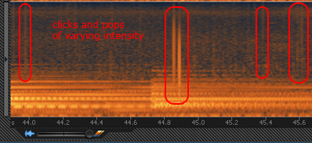

== Identifying Audio Noise

In order to speak more precisely when discussing audio noise problems, it may be useful to familiarize yourself with the different types of audio noise and how they are different from each other.

=== Hum

Hum (also called buzz) is a continuous sound that occur in a specific set of lower frequencies (often around 60Hz) and  usually are caused by electrical interference by either bad audio connections or a ground loop condition.
https://www.youtube.com/watch?v=SVZ2P0KsLic[This is a video sample] with a 60Hz tone.

image::./assets/identify_hum.png[]

=== Hiss

Hiss is a continuous broadband sound that occurs over a wider set of frequencies than hum and may be caused by fans, air conditioners, or analog sound equipment like tape cassettes.

image::./assets/identify_hiss.png[]

=== Clicks and Pops

Clicks and pops are short bursts of high level sound across the spectrum and can be caused by mechanical issues in analog systems like vinyl record players or signal processing errors in digital systems such as insufficient buffer sizes or latency.

=== Distortion

Distortion is any kind of alteration to the shape of a sound wave and is usually unwanted.
There are different types of distortion, but the most common type is amplitude distortion (also called clipping).

Clipping occurs when the peaks and troughs of an audio signal gets "`clipped`" off due to the amplitude of the wave being higher in threshold than the audio device can handle.
(Think of those unintelligible fast food drive-thru speakers.) https://www.youtube.com/watch?v=W4D6BuqL4z8[Here is a video sample] of clipping.

You can prevent distortion by reducing the sound levels on a device so that signals have enough "`headroom`" and do not trip the peak or clip indicators.

image::./assets/identify_clipping.png[]

=== Feedback

Audio feedback is the loud unpleasant squeal that occurs when a loop occurs between an audio input and output, such as a microphone pointed at a loudspeaker.
The signal gets continually amplified any may overdrive the speakers and cause potential damage, so immediate attention is required such as lowering the volume of the sound channel in question and pointing the microphone away from the amplification source.
https://www.youtube.com/watch?v=DYNGmpZPcqs[Here is a video sample] of audio feedback.
