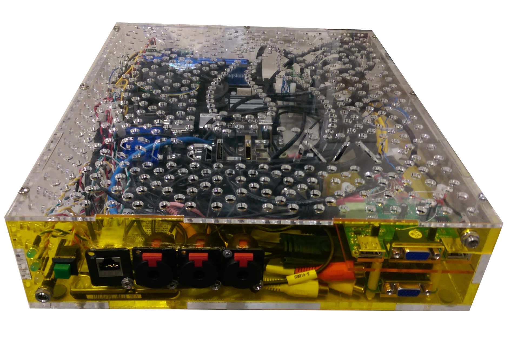

== The Podium Computer

The Podium Computer is at the heart of each room's operation.
This machine has two purposes:

. *Projector source switching*.
During a talk the video feed from the speaker's laptop is fed into the Podium Computer and passed on to the projector.
However, should a speaker not have a laptop connected, the Podium Computer can act as a backup source for the projector, showing a generic background image advertising the conference.
Additionally, in between talks, the Podium Computer can also display a web page from the network that highlights upcoming talks or displays information related to conference sponsors.
. *Video stream compositing*.
This computer also creates the final video stream to be sent to YouTube.
It has access to the room camera's video stream via its network connection and is also able to capture a video stream of the slides being projected from its on-board *video capture card*.
These two feeds are composited onto one canvas with an appropriate background image that will become the final video stream.
All of the audio for the YouTube stream is provided by the camera over the network because the camera already received the audio from the sound reinforcement system's mixer.

The follow image shows a podium computer.
Note the I/O connectors on the front panel:

The following image shows a front view of the various I/O connections on the podium computer:

image::./assets/podium-computer-front-panel-connections.png[]
