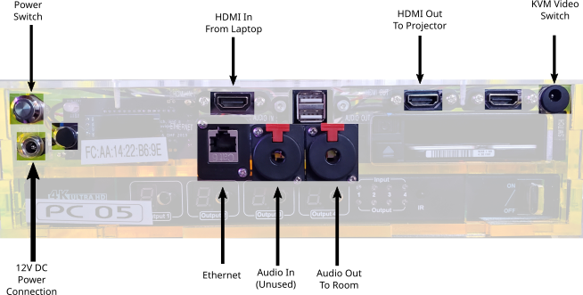

== Room Setup ==

=== Network Mixer ===

[plantuml, network_mixer, svg]
....
include::./assets/network_mixer.puml[Network Mixer]
....

* [ ] Place *Network Mixer* in a safe place near the *In-Room Audio Mixer* 
(either on the lower shelf below the mixer or on the same shelf as the mixer)

* [ ] Fold WiFi antenna down.

* [ ] Connect *AC Adapter* to *Network Mixer*. (Note: Do not turn on Network
Mixer power switch yet.)

* [ ] Connect *Network Mixer* to *Long Ethernet Cable* to *Network Switch*.

* [ ] Connect the long in-room *XLR Audio Cable* to Network Mixer's *MIX L* jack.

 Tip: This XLR audio cable should already be ran along back of the room from camera to audio mixer.

.XLR Plugs
image::./assets/XLR-connectors-small.jpg[XLR Plugs,100,100]

* [ ] Using 3 sets of *1/4” TS Audio Cables* and *1/4” TS-to-1/4” TRS
Adapters*, connect the following In-Room Audio Mixer INSERT Jacks to the
corresponding Network Mixer channels (see diagram below):

** [ ] *"Handheld Mic"* to Network Mixer *Ch. 1*,

** [ ] *"LAV Mic"* to Network Mixer *Ch. 2*

** [ ] *"DI" (Sometimes labeled "COMP")* to Network Mixer *Ch. 3*.

 Note: INSERT Jack on Zed 14 audio mixer is on top, whereas INSERT Jack on Mackie 1404 audio mixer it is on rear panel.

 CAUTION: Make sure that the TRS side (the one with the adapter) is the side plugged into the In-Room Mixer.

* [ ] Set *MIX L* knob to the maximum position.

* [ ] Connect *AC Adapter* to Network Mixer and power outlet and *Turn On*
power switch.

<<<
=== Camera DI Box ===

* [ ] Connect Long XLR Audio Cable to Female-Female XLR Coupler.

 Note: Long XLR Audio Cable runs from audio mixer area to the back of the room near the camera.

* [ ] Connect Female-Female XLR Coupler to Camera DI Box.

 Note: Camera DI Box should be placed on the floor near the tripod.

* [ ] Set ATT switch (on  Camera DI Box) to 0dB.

* [ ] Set Ground Switch to OFF.

* [ ] Tape the DI Box to the tripod.

[plantuml, camera_di_box, svg]
....
include::./assets/camera_di_box.puml[Camera DI Box]
....

<<<
=== PoE Injector (for Samsung Camera) ===

* [ ] Using Short Ethernet Cable, connect Network Switch 
(any port from 22 to 27) to DATA Jack of ZyXEL PoE Injector

* [ ] Connect power to PoE Injector, using IEC Cable.

[plantuml, poe_injector_samsung, svg]
....
include::./assets/poe_injector_samsung.puml[PoE Injector (Samsung Camera)]
....

<<<
=== Samsung Camera ===

* [ ] Unfold and place Tripod next to confidence monitor (s.a., teleprompter).
If there are no confidence monitors, place tripod in the back of the room.

* [ ] Attach PVC camera mount to tripod.

 CAUTION: Ensure that the camera and mount will extend over a leg of the tripod for stability

* [ ] Attach Samsung Camera to PVC camera mount:

** [ ] Carefully align and insert metal alignment pins on camera into camera
mount.

** [ ] Twist camera to lock.

** [ ] Secure camera to mount by connecting metal cable tether.

* [ ] Check that camera is level.

* [ ] Check that camera and mount extends over a leg of tripod for added
stability.

* [ ] Connect Camera’s Audio Cable to Camera DI Box by plugging in 1/4” RING
plug to the DI Box PARPOUT Jack. (see the labels on the cable)

  Note: The TIP plug will remain unconnected.

* [ ] Connect Camera’s Ethernet Cable into the PoE Injector’s PoE/DATA Jack.
This should power on the camera.

* [ ] Raise camera and lock in place with metal pin and tension knobs. 

 Note: Camera should be high enough such that it can look over anybody standing in the back of the room; approximately 8 feet. 
 
 WARNING: DO NOT OVERTIGHTEN the tension knobs.

[plantuml, samsung_camera, svg]
....
include::./assets/samsung_camera.puml[Samsung Camera]
....

<<<
=== PoE Injector (for PTZOptics Camera) ===

* [ ] Using Short Ethernet Cable, connect Network Switch (any port from 22 to
27) to LAN IN Jack of TP-LINK PoE Injector

* [ ] Connect power to PoE Injector, using DC 48V AC Adapter.

[plantuml, poe_injector_ptzoptics, svg]
....
include::./assets/poe_injector_ptzoptics.puml[PoE Injector (PTZOptics Camera)]
....

<<<
=== PTZOptics Camera ===

* [ ] Unfold the tripod in the back of the room in the appropriate spot.
(Look for the Ethernet cable and DI Box)

* [ ] Attach the PTZ Optics Camera (already screwed into mount) to the Tripod.

* [ ] Connect the Camera DI Box to the Camera with the 3.5mm TRS to Dual 1/4”
TS Audio Cable, connecting the 1/4” plug to the DI Box PARPOUT Jack, and the
3.5mm TRS plug into the Camera’s LINE-IN jack.

* [ ] Ensure the Camera's power switch is in the ON position.

* [ ] Connect the Long POE+Data Ethernet Cable coming from the POE injector to the
POE Splitter on the Camera Mount. This will power on the camera.

* [ ] Raise the camera high enough so that it can look over anybody standing in
the back of the room (approximately 8 feet). Lock the tripod height into place
with the appropriate metal pins and tension knobs. Do not overtighten the
tension knob.

<<<
=== Podium Computer ===

* [ ] Place the computer on the shelf of the speaker’s podium.

* [ ] When connecting cables, you want to end with a clean and tidy set of
cables running that are not in the way of the speaker and not a rats nest. 
Do not allow wires to dangle.

* [ ] Connect the Ethernet cable labeled “AV” coming from the network
switch into the PC Ethernet jack. The other Ethernet cable labeled “Speaker” is
for Presenter's Laptop use. If the Ethernet cables are not already plugged into
the network switch, you will need to connect the cables to the switches.
Use an empty port in the AV VLAN range (22-27, confirm with diagram posted on Switch)

* [ ] Connect the HDMI plug (using the side without the adapters) of the
Speaker’s Laptop HDMI/VGA/Audio cable to the HDMI In jack.

* [ ] Connect the HDMI cable going to the projector to the HDMI Out jack.

* [ ] Connect the KVM Source Switch to the Switch jack in the upper right by
pushing in the connector. Do not screw the connector in.

* [ ] Plug the AC adapter power cord into a power outlet of the
surge protector inside or near the podium.

* [ ] Connect the AC Adapter to the Podium Computer.

* [ ] Alert the NOC that the computer is connected and if instructed, press the
Power Switch to power on the machine. The machine will turn on and the power button
will light up green. If the computer does not come on, wait 45 seconds, watching the
LCD screen on the front panel to see if penguins display on the screen.

* [ ] Confirm that the Podium Computer has a good network connection by looking
at the inner motherboard through the clear right side wall of the computer.
You should see both a solid blue Link light and a flashing orange Activity light from the right.

 TIP: The light is located roughly underneath the penguin logo etched on top of the box.

* [ ] Test the KVM Video Switch by pressing the pushbutton on the KVM remote.
Each time you press the remote, one of two lights near the bottom
of the front of the computer will turn on, indicating which source is active.

* [ ] Tape the Laminated Speaker Reminder Flyer to the top of the podium.

* [ ] Tape the KVM switch about 6 inches from the bottom edge of the podium
towards the left edge of the top of the podium.

* [ ] Tape down the *HDMI Adapters Cable Set*, leaving enough slack in the cable
on the side with the adapters so that the presenter can comfortably plug the
adapters into their laptop.
