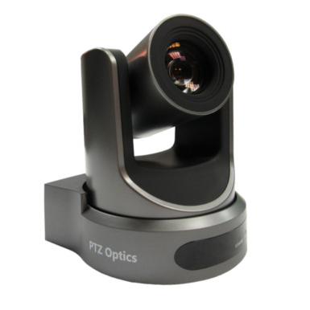

== Video Subsystem

Video of each talk is streamed live on ** YouTube ** on the https://www.youtube.com/channel/UCN2nbMPLJWv3Y%5F%5F4JuF_hMQ[SCaLE Youtube Channel].
The video contains both the feed from the room's camera and a feed of the slides combined together into a picture-in-picture style layout with the slides being the larger, primary video image for legibility and the room camera being the smaller, secondary image.
The image below shows a sample frame of the final video output as shown on YouTube:

image::./assets/sample-talk-youtube.jpg[]

The cameras that provide the video of the speaker are special network-controlled *Pan-Tilt-Zoom (PTZ) cameras*.
This allows us to remotely control where the camera is pointing at from the A/V NOC.
The audio for the video stream is provided to the camera from the audio subsystem's mixer.
This audio track is multiplexed into the video stream by the camera and the resulting stream is made available over SCALE's LAN to be viewed by either the NOC Monitoring System or the Podium Computer.
You can think of the camera as a server that serves a video stream to any client that connects to it.

The following image shows the PTZOptics Camera in use.

